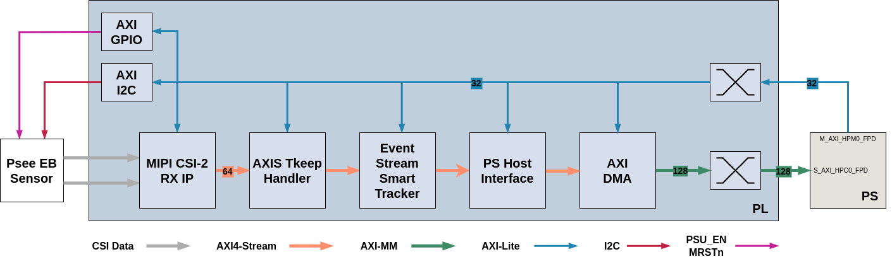

# Prophesee KV260 Project

## Overview

The Prophesee KV260 FPGA project is designed for the AMD KV260 Vision AI Starter Kit. It captures event data from a single MIPI sensor device and forward it to the FPGA Processor Side (PS) for processing and rendering.

The figure below shows the top level diagram of the KV260 project with the data pipeline.

## IP Used

- The MIPI CSI-2 RX SubSystem module from AMD is the receiver of the 2 MIPI Lanes that inputs raw data from the EB Sensor (among with clock lane). It implements a CSI-2 receive interface according to the MIPI CSI-2 standard v2.0 with underlying MIPI D-PHY standard v1.2. The subsystem is configured to received RAW8 pixel format with a 1500 Mbps line rate and output a AXI4-Stream 64 bits width that support Prophesee event format 2.1 (event-vector, high event rate, 64-bit based). For more information, see the MIPI CSI-2 Receiver Subsystem
Product Guide (PG232).
- The Prophesee AXIS tkeep Handler manages the tkeep signal to be always fully valid to feed the next component. Tkeep is a vector in AXI4-Stream where the value of one bit index ‘n’ indicates if corresponding byte ‘n’ in the tdata vector is valid of not (‘0’: invalid, ‘1’:valid). As the Event Format 2.1 required full 64-bits valid at each clock cycle, this component handle the tkeep to be always 64-bits valid. In case of bypassing the whole pipeline, tkeep is not handled by this component and is forwarded to the PS Host inferface.
- The Prophesee Event Stream Smart Tracker (ESST) component is in charge of the back-pressure coming from the output data pipeline (latency from PS or in board application). This component can drop some events in this case and regenerate useful ones (such as time-related events) in case some are missing. Counters and flags are available is such issues occurs in the data pipeline.
- The Prophesee PS Host Interface is in charge of filling the DMA buffers with events so that they can be processed by the PS. Buffers are passed to the PS when contain the expected number of events when a customizable delay as been reached. signals that are useful to it. Such as tlast controlled either by packet size or timeout occurs if data input has low rate. A special event can also be inserted in the data pipeline if such issue occurs. All of those are configurable via registers.
- The AXI DMA (AXI Direct Memory Access) from AMD provides high-bandwidth direct memory access between memory and AXI4-Stream-type target peripherals. Its optional scatter gather capabilities also offload data movement tasks from the Central Processing Unit (CPU) in processor based systems. Initialization, status, and management registers are accessed through an AXI4-Lite slave interface.
